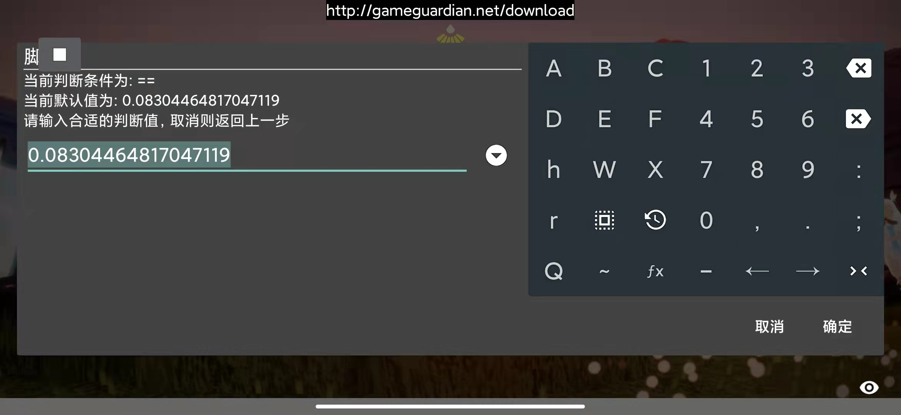

# RChainer
  

+ 适用于GameGuardian的动态基址获取工具，支持自动检验可行链路、自定义判断条件和导出基址脚本。

## 简介
+ RChainer是在chainer *v0.2* 以及chainer *v0.46* 的基础上做了些许优化，使得在GG修改器上寻找动态基址的过程变得更加简单。

## 使用
1. 搜索列表的数据量为1，执行 **RChainer.lua**

2. 选择合适的深度和最大偏移量 
这里写 *4 3000* 获取不到可行链路，后面改成 *4 4000*

3. 经过校验后的可行链路

4. 选择合适的判断条件

5. 输入合适的判断值

6. 保存文件成功 
2个文件是指配置文件和动态基址脚本

7. 执行 *动态基址脚本* 后，打印信息和基址链路

